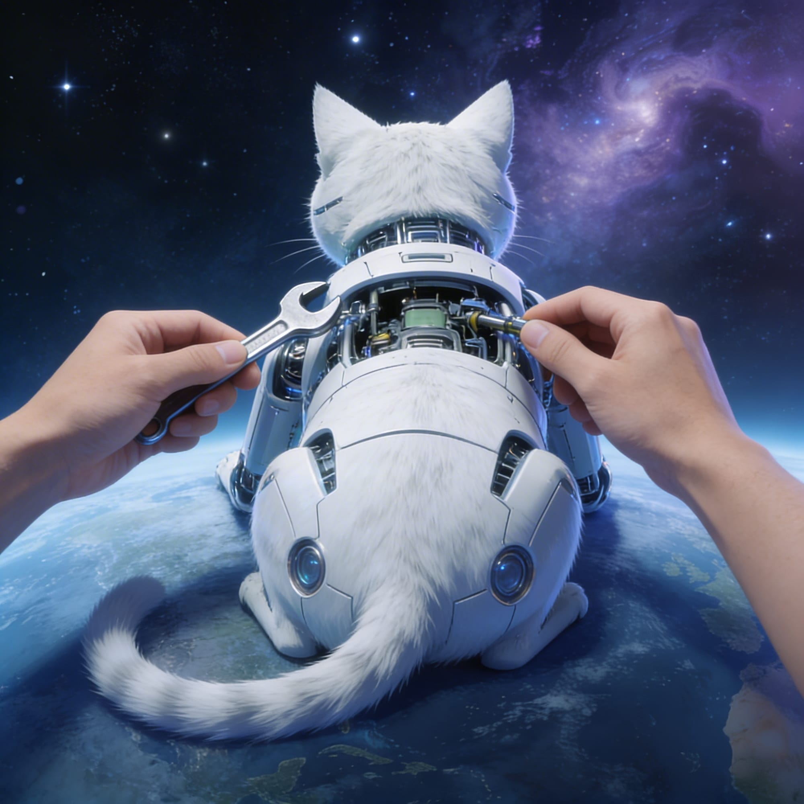
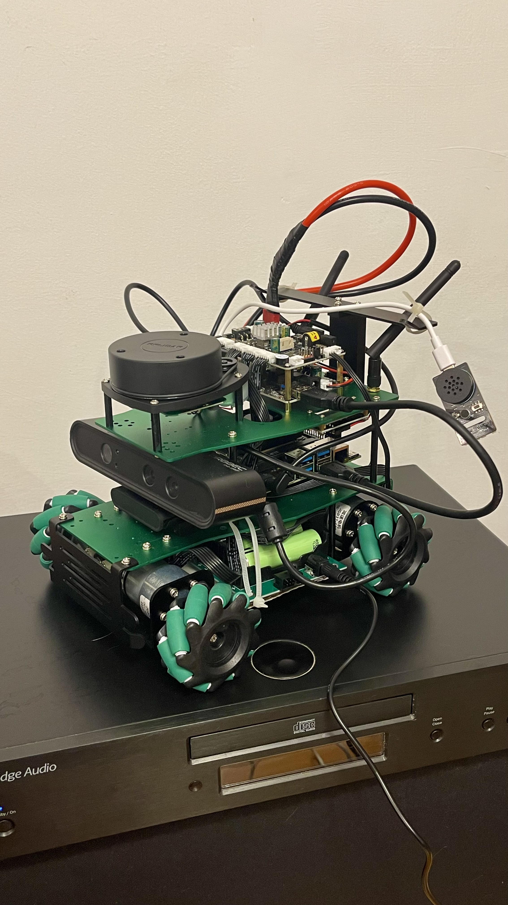

# Cat Patrol Robot

<p align="left">
  
  
</p>

## What this project is

A learning project — build a real, useful indoor patrol robot end-to-end, on
real hardware, while learning **modern C++** and **ROS 2** along the way. The
robot wakes up on a schedule, drives a patrol of pre-recorded waypoints in a
room, takes photos at each waypoint, runs a vision pipeline to detect and
identify cats, and (when it spots a cat) interrupts its patrol to capture a
close-up, send an email with the photo, and bark at the cat through a
Bluetooth speaker before resuming the patrol.

The project is sized in phases so that finishing each one feels like a real
milestone rather than a chore. Phase 0 (sensor and odometry foundation work)
is complete; Phase 1 (room mapping with `slam_toolbox`) is up next.

## Hardware platform

The chassis is a **Yahboom X3** with the standard expansion stack on top:

| Component | What it is | Used for |
|---|---|---|
| **Yahboom X3 chassis** | 4-wheel mecanum-drive base, ~25 cm wheelbase | Holonomic motion (forward, sideways, rotate) |
| **Rosmaster MCU** | STM32-class microcontroller on the chassis board, ships proprietary firmware | Real-time per-wheel PID, encoder reading, IMU integration. Talked to over USB-serial (`/dev/ttyUSB1`). |
| **NVIDIA Jetson Orin NX** | The "brain" — runs Ubuntu 22.04 + ROS 2 Humble | All ROS nodes, vision, navigation logic |
| **RPLiDAR A1** | 2D 360° laser scanner, ~10 Hz, ~12 m range | SLAM, AMCL, obstacle avoidance |
| **Orbbec Astra Pro** | RGB + depth camera (USB) | Cat detection (color), close-range obstacle stop (depth) |
| **9-axis IMU** | Gyro + accelerometer + magnetometer, on the Rosmaster board | Heading and short-term motion estimate (fused into `/odom` via `robot_localization` EKF) |
| **3S LiPo battery** | ~11.1 V nominal, ~12.6 V full | Power for the whole robot. Voltage available on `/voltage` ROS topic. |
| **Bluetooth speaker** | Generic BT speaker, paired to the Jetson | Plays the "bark" audio when a cat is detected |
| **Buzzer + RGB LEDs** | On the Rosmaster board | Status feedback (pre-Bluetooth-pair startup tones, low-battery warning) |

The robot is fully autonomous on-board — no off-board compute, no cloud
inference. The Jetson does its own vision and navigation. Email is sent
directly from the Jetson over Wi-Fi.

## Plan and current status

The full step-by-step execution plan, with C++/ROS 2 learning goals for
each phase and "done-when…" criteria, lives in:

- **[plan.md](plan.md)** — the project plan, phase by phase
- **[phase0-status.md](phase0-status.md)** — what was actually done in Phase
  0: files created/modified, topics observed, commands used, lessons
  learned, calibration record

## Repo layout

This package (`cat_patrol_robot`) is the original monolithic patrol node and
its support scripts. New work from Phase 1 onward will live in **separate
ROS 2 packages** under `yahboomcar_ws/src/` — `odom_drift_checker` (Phase 0
diagnostic), eventually `patrol_manager`, `cat_detector`, `cat_patrol_msgs`,
etc.

```
yahboomcar_ws/src/
├── cat_patrol_robot/        ← this package (existing monolithic patrol)
│   ├── README.md            ← this file
│   ├── plan.md              ← project plan
│   ├── phase0-status.md     ← what's actually done
│   ├── launch/              ← ros2 launch files for the full stack
│   ├── src/                 ← C++ patrol node sources
│   ├── include/             ← C++ headers
│   ├── config/              ← YAML parameter files
│   ├── scripts/             ← Python diagnostic scripts (wheel balance, sync)
│   └── yahboom_overlay/     ← patches to vendor yahboomcar_bringup (kept here so they survive vendor re-clones)
└── odom_drift_checker/      ← Phase 0 deliverable: small standalone diagnostic node
```
