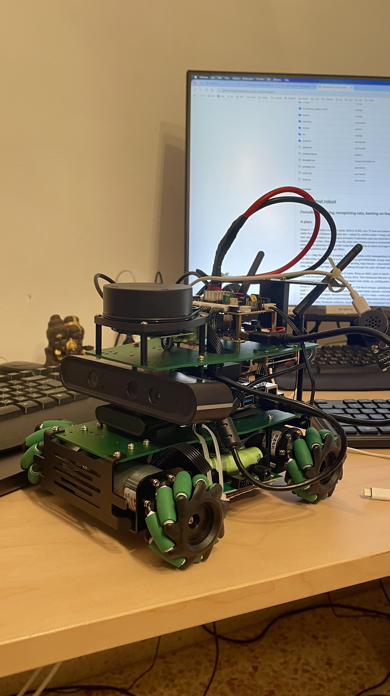

# Cat patrol robot Savelij

## Periodically walking, recognizing cats, barking on them

## A plan:

Phase 0 — Foundation check (~1 week). Before SLAM, your TF tree and odometry must be sane. Write/verify a URDF for the X3 (Yahboom provides one — adapt it), 
confirm odom → base_link is published, and do the classic test: teleop the robot in a 2m square and back; 
if odometry says you returned within ~10–20cm and a reasonable heading, you're fine. Check ros2 run tf2_tools view_frames shows a 
connected tree with the lidar frame. C++ angle: write a small odometry-drift-checker node that subscribes 
to /odom and logs accumulated error — good practice with subscriptions and message filters.

Phase 1 — Map the room (1–2 weeks). Run slam_toolbox while teleoperating the robot around the room, 
then save the map (map_saver_cli). Goal: a clean occupancy grid PGM/YAML of your room. Learning here is mostly conceptual — occupancy grids, 
lidar scan matching, loop closure — plus practical launch-file and YAML-param skills. Mesh furniture legs and your 
cats walking through the scan will teach you about map noise the hard way.

Phase 2 — Localize on the saved map (1 week). Bring up AMCL (part of Nav2) with your saved map and verify in RViz 
that the particle cloud converges as you drive. This introduces lifecycle nodes — Nav2 is built on them — 
which is a genuinely interesting C++ pattern (managed node states, on_configure/on_activate callbacks).

Phase 3 — Autonomous navigation (2–3 weeks). Full Nav2 bringup: global/local costmaps 
(this is your "don't touch walls" — inflation radius tuning matters a lot on a small robot), planner, controller. 
First milestone: click a goal in RViz and watch it navigate. Second milestone — the real C++ meat — write your own 
action client node in C++ that sends NavigateToPose goals programmatically. 
You've studied action client architecture; this is where it becomes real: goal handles, 
feedback callbacks, result futures. Note the conceptual rhyme with std::future/std::packaged_task from the concurrency book.

Phase 4 — Patrol behavior (2–3 weeks). This is the heart of your project and almost pure C++ design work. 
Build a PatrolManager node implementing a state machine: SLEEPING → WAKING → PATROLLING(waypoint i) → RETURNING → SLEEPING, 
with an INVESTIGATING state reserved for Phase 6. Define 4–6 waypoints around the room (record them by driving to spots and capturing poses), 
loop through them via your action client, take a photo at each. Wake-up scheduling: a ROS timer for "every N hours" is simplest; 
a systemd timer that launches the stack is the more power-friendly option you already know how to build. 
Design decisions to enjoy: composable node vs. standalone, single vs. multithreaded executor, 
callback groups so your timer doesn't starve action feedback. This phase exercises practically everything from C++ Concurrency in Action.

Phase 5 — Cat detection (2–4 weeks, parallel-friendly). Two sub-stages. First, generic detection: run YOLOv8 
(or jetson-inference's detectnet) on the Orin NX — "cat" is a COCO class, so this works out of the box. 
Wrap it in a ROS2 node subscribing to the camera topic via cv_bridge, publishing detections. 
Export to TensorRT for real-time inference on the Jetson. Second, which cat: collect a few hundred photos 
of each cat (your patrol pics become your dataset — nice flywheel), fine-tune a small classifier 
(or YOLO with two custom classes) to distinguish them. Given one cat is the aggressive one, per-cat 
identification has obvious… tactical value. C++ angle: this node is a great producer-consumer exercise — 
camera callback pushes frames into a thread-safe queue (you built those!), inference thread consumes, drop stale frames under load.

Phase 6 — Integration: see cat → capture → bark (1–2 weeks). Wire detection into the patrol state machine: 
on detection during patrol, transition to INVESTIGATING — cancel the current nav goal (action cancellation, 
a part of the API people rarely exercise), save the annotated image, email it with the cat's name, play the bark. 
Optionally compute the cat's approximate position (detection bearing + lidar range or depth camera) and 
send a nav goal toward it for a closer shot. Then resume patrol from the interrupted waypoint.

Phase 7 — Polish (ongoing). Ideas in rough priority order: battery monitoring with return-home-when-low 
(you know that BMS intimately now), a small web dashboard showing the map + robot pose + latest cat sightings, 
patrol logs ("Murka detected 3 times near the couch"), and multi-room expansion.

A few practical tips: do phases 1–3 with the robot tethered to a monitor or via RViz over 
your TP-Link robot network — debugging Nav2 blind is misery. Tune costmap inflation conservatively at first; 
a patrol robot that hugs walls will eventually kiss one. And keep each phase as its own node/package boundary 
in the repo — patrol_manager, cat_detector, etc. — it'll keep the architecture 
clean and mirrors how you'd structure it professionally.

